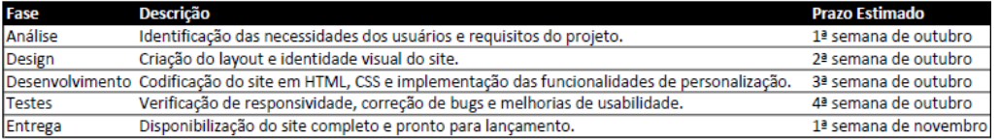

# Projeto Bikcraft

## 1. Texto Introdutório
O **Bikcraft** é uma plataforma desenvolvida para a comercialização de **bicicletas elétricas personalizadas**, focada em oferecer produtos de alta qualidade com um toque de inovação. O site proporciona uma navegação interativa, onde o usuário pode explorar diferentes modelos, tecnologias e serviços relacionados ao universo das bicicletas. Além disso, foi pensado para garantir uma experiência fluida e visualmente agradável, adaptável a qualquer dispositivo, graças ao design responsivo.

Nosso objetivo é promover a **mobilidade sustentável**, permitindo que os clientes escolham bicicletas personalizadas com componentes modernos e precisos. O site também oferece funcionalidades extras, como seguros específicos e depoimentos de clientes satisfeitos, criando um ambiente de confiança e segurança para quem nos visita.

## 2. Objetivos

### 2.1. Objetivo Geral
Desenvolver um site dinâmico e adaptável, que permita a venda de bicicletas elétricas personalizadas, priorizando a **tecnologia**, **ergonomia** e **sustentabilidade**. Queremos proporcionar uma experiência de compra diferenciada, onde o cliente se sinta envolvido do começo ao fim.

### 2.2. Objetivos Específicos
- Apresentar uma variedade de modelos de bicicletas elétricas, com informações detalhadas, imagens e preços.
- Oferecer opções de personalização, permitindo que o cliente escolha cores e componentes.
- Destacar as tecnologias mais recentes usadas nas bicicletas, como motores elétricos e rastreadores.
- Incluir serviços de seguro, com planos adaptados às necessidades dos clientes.
- Promover nossos parceiros comerciais através de uma seção específica.
- Garantir que o site seja totalmente responsivo, com excelente performance em dispositivos móveis.
- Integrar depoimentos de clientes para gerar mais confiança e engajamento.

## 3. Requisitos Básicos

### 3.1. Requisitos Funcionais
- **Navegação clara:** O site deve permitir uma navegação simples entre as principais seções, como Bicicletas, Seguros e Contato.
- **Sistema de produtos:** As bicicletas devem ser exibidas com imagens de alta qualidade, descrições completas e preços.
- **Personalização:** Deve ser possível personalizar cores e componentes da bicicleta diretamente no site.
- **Formulário de contato:** Um espaço para os usuários tirarem dúvidas e pedirem mais informações.
- **Seguros:** Exibir detalhes dos planos de seguro disponíveis, com um botão de ação para inscrições.
- **Design responsivo:** O site deve se adaptar a várias resoluções, oferecendo uma boa experiência em qualquer dispositivo.
- **Redes sociais:** Ícones que levem os usuários para as redes sociais da empresa.
- **Suporte a múltiplos idiomas:** A plataforma deve ser capaz de incluir novos idiomas, caso necessário.

### 3.2. Requisitos Não Funcionais
- **Performance:** O site deve carregar rapidamente, dentro de um tempo máximo de 3 segundos em conexões comuns.
- **Escalabilidade:** O código deve ser fácil de expandir, permitindo a adição de novos produtos e funcionalidades.
- **Segurança:** Deve-se implementar medidas de segurança que protejam os dados dos usuários, especialmente em áreas como o formulário de contato.
- **Compatibilidade:** O site deve funcionar corretamente nos navegadores mais utilizados, como Chrome, Firefox, Safari e Edge.
- **Acessibilidade:** Seguir práticas que garantam que pessoas com deficiência possam navegar no site, como textos alternativos para imagens e bom contraste de cores.

## 4. Cronograma


## 5. Conclusão
O projeto **Bikcraft** pretende ser uma referência para quem busca bicicletas elétricas que combinem **design** e **alta tecnologia**. Cada etapa do desenvolvimento foi cuidadosamente planejada para garantir que o cliente tenha uma experiência agradável e sem complicações. Nosso foco é unir inovação, funcionalidade e acessibilidade, criando um site que atenda às expectativas do mercado e dos nossos clientes.

---
## Explicação da Estrutura
**head**

    <meta charset="UTF-8">: Define o conjunto de caracteres como UTF-8.
    
    <meta name="viewport" content="width=device-width, initial-scale=1.0">: Ajusta a largura do layout com base na tela do dispositivo.
    
    <title>: Define o título da página.
    
    <meta name="description" content="...">: Meta descrição para SEO.
    
    <link rel="stylesheet" href="./css/style.css">: Link para o arquivo CSS.
    
    <link rel="preconnect" href="https://fonts.googleapis.com"> e <link rel="preconnect" href="https://fonts.gstatic.com" crossorigin>: Pré-conexão com Google Fonts.
    
    <link href="https://fonts.googleapis.com/css2?family=...&display=swap" rel="stylesheet">: Importa fontes do Google Fonts.
    
 **body**

    <header>: Cabeçalho da página com logo e menu de navegação.
    
    <main>: Seção principal de introdução com título, descrição e imagem.
    
    <article class="bicicletas-lista">: Lista de bicicletas disponíveis com imagens e preços.
    
    <article class="tecnologia-bg">: Seção de tecnologia das bicicletas.
---
## Dependencias

### 1. **Arquivos CSS**
- **`<link rel="stylesheet" href="./css/style.css">`**: Este link aponta para um arquivo CSS local chamado `style.css`, que contém as regras de estilo para a página. Ele é essencial para definir a aparência visual do site.

### 2. **Google Fonts**
- **Pré-conexão com Google Fonts**:
  ```html
  <link rel="preconnect" href="https://fonts.googleapis.com">
  <link rel="preconnect" href="https://fonts.gstatic.com" crossorigin>
  ```
  Essas linhas ajudam a melhorar o tempo de carregamento das fontes, estabelecendo uma conexão antecipada com os servidores do Google.

- **Importação de fontes do Google Fonts**:
  ```html
  <link href="https://fonts.googleapis.com/css2?family=Merriweather:ital,wght@0,300;0,400;0,700;0,900;1,300;1,400;1,700;1,900&family=Poppins:ital,wght@0,100;0,200;0,300;0,400;0,500;0,600;0,700;0,800;0,900&family=Roboto:ital,wght@0,100;0,300;0,400;0,500;0,700;0,900&display=swap" rel="stylesheet">
  ```
  Este link importa várias famílias de fontes (Merriweather, Poppins e Roboto) do Google Fonts, permitindo que você use essas fontes no seu site.

### 3. **Imagens e Logos**
- **Logo da empresa**:
  ```html
  
  ```
  Este link aponta para uma imagem SVG local que serve como logo da empresa.

- **Imagens de produtos e introdução**:
  ```html
  
  
  
  
  ```
  Esses links apontam para imagens locais que são usadas para ilustrar os produtos e a introdução da página.

### 4. **Meta Tags**
- **Meta tags para SEO e responsividade**:
  ```html
  <meta charset="UTF-8">
  <meta name="viewport" content="width=device-width, initial-scale=1.0">
  <meta name="description" content="Bicicletas elétricas de alta precisão e qualidade, feitas sob medida para o cliente. Explore o mundo na sua velocidade com a Bikcraft.">
  ```
  Essas meta tags são importantes para definir o conjunto de caracteres, ajustar a largura do layout com base na tela do dispositivo e melhorar a otimização para motores de busca (SEO).
---
## Como executar
1. Baixe o arquivo.zip do repositorio.
2. Descompacte o mesmo.
3. Clique duas vezes sobre o arquivo index.html.
---
